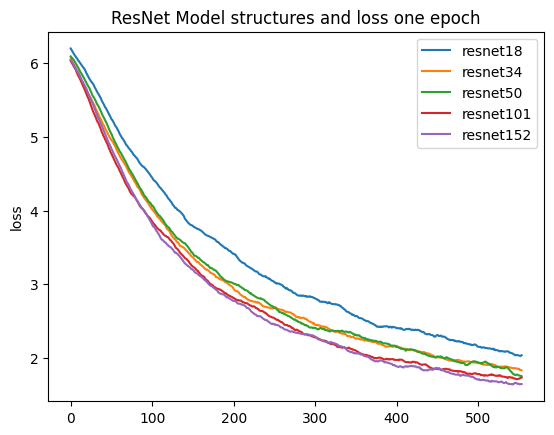
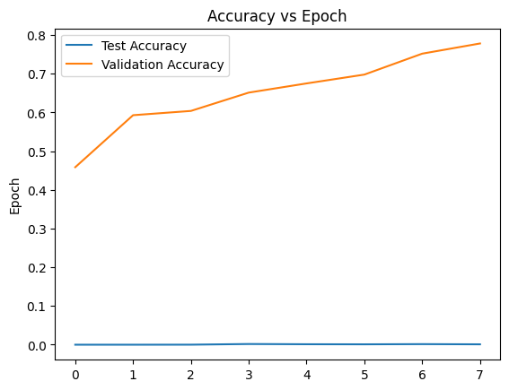

# ResNet for bird classification

## Problem description
I competed in the class's Kaggle competition for bird classification https://www.kaggle.com/competitions/birds23sp/overview. In general, the competition is to find the most accurate model to predict a bird's species from an image of it. For my project, I added constraints. My goal was to find the best ResNet Model structure for predicting a birds species after training the pre-trained model for one epoch. In addition, to try to get a higher score for the competition, I trained resnet152 for more epochs and submitted its predictions. 

## Previous work
I used the class's Transfer Learning to Birds tutorial - https://colab.research.google.com/drive/1kHo8VT-onDxbtS3FM77VImG35h_K_Lav?usp=sharing#scrollTo=ciUXCJ5LvN1p.
I also used the class's ImageNet Transfer Tutorial - https://colab.research.google.com/drive/1EBz4feoaUvz-o_yeMI27LEQBkvrXNc_4?usp=sharing#scrollTo=5lYNVRr8UbCJ.
All the models I used were ResNets with different model structures loaded pre-trained using pytorch - https://pytorch.org/hub/pytorch_vision_resnet/.

## My approach
First, I loaded the Kaggle dataset into Google CoLab by downloading the dataset then uploading it as my own dataset. I loaded it into CoLab using the Kaggle API. I then used the code from the class's Transfer Learning to Birds tutorial with some minor changes to get the pytorch DataLoaders from the dataset. Again, mostly using the code from the tutorial, I trained each resnet18, resnet34, resnet50, resnet101, resnet152 for one epoch and saved their states in checkpoints in my Google Drive. One notable change from the tutorial code, is I normalized all the images to be as described required by the pytorch ResNet page. I also had to make the batch size smaller to get the GPU ram usage small enough for resnet101 and 152 to work in colab. I then used Matplotlib to plot the losses over the one epoch for each model against each other. I also ran resnet152 for 8 epochs and  used the resulting model to generate predictions for the competition. I could not run any more than 8 because I ran out of storage. I calcululated and plotted the test and validation accuracies afer splitting the data and compared a graph (which was not useful since the test data was all labeled the same). However, I concluded that the model at 8 epochs was not overfitting and used that to send up my predictions..

## Datasets
The dataset I used was the dataset given by the Kaggle competition - https://www.kaggle.com/competitions/birds23sp/data.

## Results

As you can see, the longer the model structure, the lower the loss over one epoch. This is not surprising as that is the same trend for performance for these models on ImageNet. 

I could only run 8 epochs because of storage and cannot compare the test accuracies because all of the test data is labeled as bird 403 even though they are different birds. I am showing this figure to demonstrate would I would have used in my decision making for if my model is overfitting or not. I know at 8 epochs the model is not overfitting because when submitting on kaggle, the test accuracy of the model at the 8 epoch checkpoint is significantly higher than at the checkpoint of epoch 7.

## Discussion

My project's experiments were not as extensive as I would have liked them to be. I would have liked to train each ResNet model structure for more epochs and predict using those models and experiment with other pre-trained models other than ResNet. However, I started my project trying to create my own model on attu. I had a working model (was not very accurate ~1% training accuracy) but attu ran into issues (I think space issues). All of my main python file that defined my model and had all of the code that I used to pre-process the data to be usable in the way I was using the model (included resizing all of the images to 256x256 and 64x64) was deleted. I also completely lost access to attu, so I pivoted to this new project. Because of this late start, I didn't have enough time to train the amount of models and for the amount of epochs I wanted to. I also would have liked to run my resnet152 for more epochs but I ran out of storage on google drive to store checkpoint iformation and I did not want to delete my previous checkpoints.
